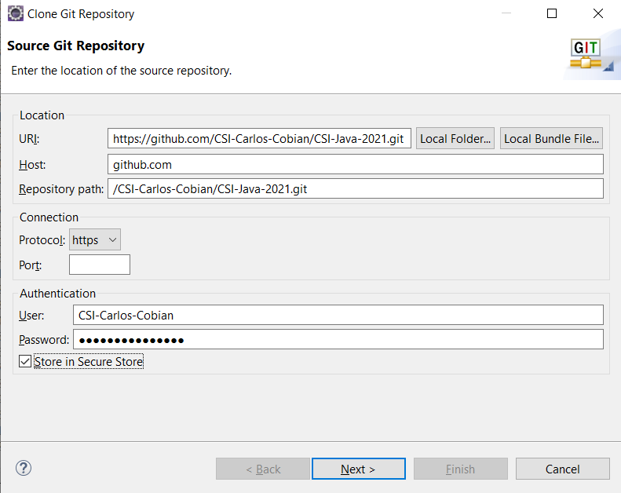

        

 

# Module 1: Git and GitHub
### Welcome to Java-2021! In this class, we will be using GitHub as our code repository. This is an industry standard that should be understood by all students looking to pursue a career path related to software.
 

# What is Git?
*"Git is a free and open source distributed version control system designed to handle everything from small to very large projects with speed and efficiency."*
 
&nbsp;&nbsp;&nbsp;&nbsp;&nbsp;&nbsp;&nbsp;&nbsp;&nbsp;&nbsp;&nbsp;&nbsp;&nbsp;&nbsp;&nbsp;&nbsp;&nbsp; \- [The Git Website](https://git-scm.com/)

#### Git allows you to track changes in a file system, referred to as a repository. Some examples would be adding and removing files, adding and removing lines in a file, renaming files.

 

## Repository
*"A receptacle or place where things are deposited, stored, or offered."*
 

&nbsp;&nbsp;&nbsp;&nbsp;&nbsp;&nbsp;&nbsp;&nbsp;&nbsp;&nbsp;&nbsp;&nbsp;&nbsp;&nbsp;&nbsp;&nbsp;&nbsp; \- My google search.
 

#### In class, we will refer to repositories as the copies of the course file-system that each one of us holds. Repositories are both local and remote, meaning that repositories are available both offline on your machine, and online on a remote webserver. In our class, we will use `GitHub` as our remote host.

 

## Pull
#### When you pull a repository, you are updating your local copy with any changes that have been made on the remote version.

 

## Commit
#### A commit saves any changes made to files on your local machine, to the local repository. Before committing, you will select which files and/or lines you would like to include. You don't have to include all of them, but you should make sure that what you are committing is correct. A commit requires a message. This message must be descriptive of what is being changed. This helps you keep track of every version change. Commits may be deleted or reverted locally before a Push.

 

## Push
#### Pushing to your remote repository will upload all pending commits. You should make sure that all commits are stable and correct before pushing. Once a commit has been pushed it will be available to anyone working on the repository. It is easier to delete or revert commits that are local and unpushed, as another user may pull bad code before you fix it. 

 

 

## A Diagram

 

# Install [GitHub Desktop](https://desktop.github.com/). 
### **(Optional since Eclipse includes a Git solution)**. 
Any students may use [GitHub Desktop](https://desktop.github.com/) as it is the easiest solution to the git dependency.

 

# What is GitHub?
Think of GitHub as an Instagram of Code. A whole bunch of programmers from all around the world share their code so that others may view, comment and like it. They all use the technology of Git and share it on this Hub. GitHub is free, but you may pay to keep your repositories private.

 

## Set up a GitHub Account.

### Go to [GitHub.com](https://github.com) and Sign Up **Correctly**. `(2pts)`
* Use your student Email.
* Use the following format for your <u>**username**</u>: CSI-Name-Lastname. 
* Pay attention to Capitalization.
* Use my github name as an example: `CSI-Carlos-Cobian`
 

 
*If it already exists, include your second last name.*

 

# What is a branch?     
Branches are different versions of a repository. A central branch(`main`) represents a repository, while many others represent modifications that are incomplete, in development, or just different. 

 

## Fork the class repository. `(1pts)`
Forking a repository will create a copy on your GitHub account. You own it now. You may freely alter this copy to take class notes and answer questions. These changes will only be reflected on your copy **(fork)** of the repository. 
 

### Visit the class repo and click on `fork`. (top right)
https://github.com/CSI-Carlos-Cobian/CSI-Java-2021

 

# Set up your development environment

## Install [Eclipse IDE](https://www.eclipse.org/downloads/)
## If prompted, Download and install [JDK](https://www.oracle.com/java/technologies/javase-jdk16-downloads.html)

## Clone the repository into your machine `(2pts)`

 

### Clone using Eclipse IDE
You may manage your git by using Eclipse's integrated solution. Press `ALT+SHIFT+Q`, release, and then press `Q` again to search eclipse for tools. Type `git` and select `Git Repositories`. Clone your fork using the following configuration as an example. Remember that `CSI-Carlos-Cobian` is to be replaced with **your** username.

 

*This requires extra configuration steps and is no longer going to be used in the course. Using GitHub Desktop or SourceTree is encouraged.*

 

### <u>Clone using GitHub Desktop</u>
After signing in to GitHub, your fork should show up. Click on it and  then select clone. **GitHub Desktop** automatically creates a folder on your Documents called <u>GitHub</u>.  Within this folder, you will find a folder named <u>CSI-Java-2021</u> containing your cloned course.

 

### [Source Tree Git](/../../tree/main/Modules/SourceTree/Setup.md) **(Optional)** 

* #### Provides easier visualization of branches and history. 
* #### Requires many 3rd party authorizations.

 

# Using Git
You may clone a repository without forking it, but only `contributors` may push changes to it. When you fork a copy, it becomes your own. 
 

*You may also update your copy **(fork)** of the repository to reflect any changes I have made to the course, without overwriting your individual changes.*

 

## Update your fork:
You may update your fork on GitHub.com. When your fork is out of date, a banner will show up. Click on it to update your fork with any changes i've made. This is called pulling upstream. You're pulling changes from the primary remote repository, into **your** remote repository.
 

To download these fork updates to your **local repository(PC)** simply pull.
 

<!-- You may update both simultaneously from Visual Studio by selecting. -->
<!-- 
`Source Control` > Branch > Merge Branch
Select `upstream/main`  
-->
<!-- #TODO: Update for eclipse -->

`upstream/main` represents the repository you've forked. it may also be called `origin`. 'Merging' it into you branch means that you're combining your modifications with any updates the owner has issued since your fork was created. 

 

# Class Discussion
## Answer the questions on the Markdown file located within your <u>`Module1`</u> directory (Module1.md). `(4pts)`

<!-- This is a comment. It is not processed by the code -->
<!-- Welcome! These are your questions. -->
<!-- Answer using full sentences to receive all points. -->
<!-- 

What is the difference between Git and GitHub?

 - Answer:

What is the difference between a git commit and a git push?

 - Answer:

What is the difference between a pull, and an upstream pull?

 - Answer:

Was any part of these instructions unclear or incomplete?

 - Answer:

Type down any class notes below this sentence:

Lackluster responses may result in point deductions.
-->

* ### Save the file. Commit your changes and push them to your remote repository by the end class. `(1pts)`
* ### You may complete the answers by issuing additional commits and pushing them before the next class.

 

## [Next Module ->](/../../tree/main/Modules/Module2/Module2.md)