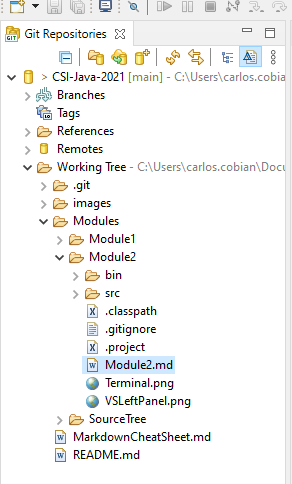
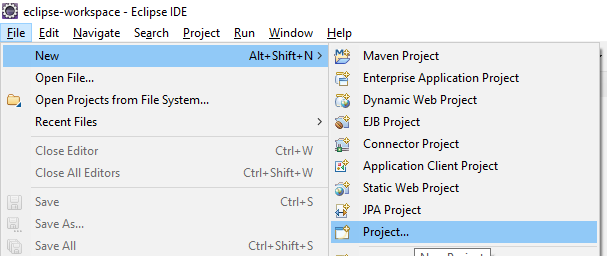
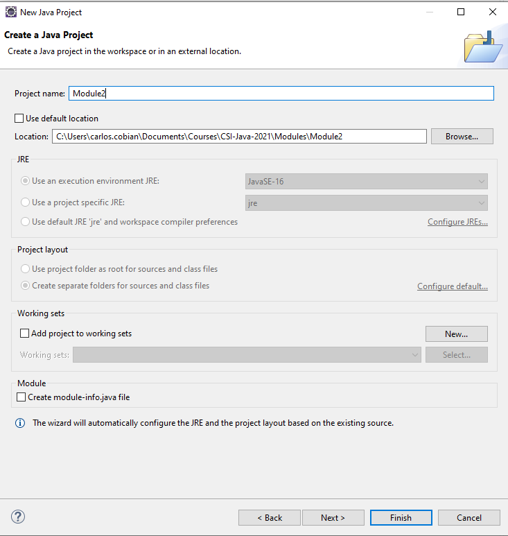
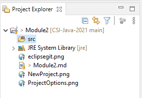
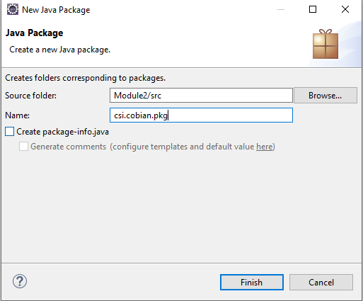
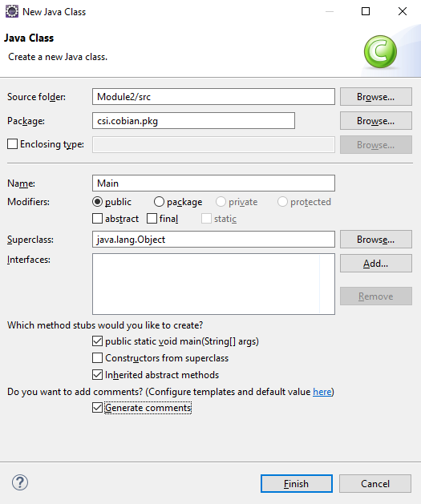
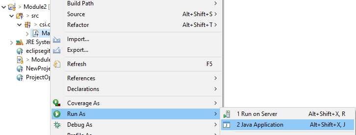

        

 

# Module 2: Using Eclipse IDE

### Merge origin/master. This is another term for Fetching Upstream. `(1pts)`

 

## What is [Markdown](https://www.markdownguide.org/getting-started/)?
### Markdown is a lightweight markup language that you can use to add formatting elements to plaintext text documents.

 

### The first thing you will see on the left-most side of Eclipse IDE is the file system for the class.

### Expand your working tree to locate Module2.md

 

 

### By pushing a markdown file into GitHub a nice HTML webpage is rendered.

 

### Eclipse fails to load images in the local markdown preview.*(I have yet to determine a solution)* For this reason i edit them using [Visual Studio Code](https://code.visualstudio.com/). I personally prefer it to view the module files.

 

**(Optional)**

*Visual Studio Code <u>may</u> be used in class instead of Eclipse. To do so you must install [JDK](https://www.oracle.com/java/technologies/javase-jdk16-downloads.html). You will also be responsible for keeping a correct package structure. This is not complicated but requires extra work. I might not cover this topic in detail during class, but i may discuss it during office hours.*

 

# Create a Java project using Eclipse `(2pts)`
## It must be stored in the Module2 of your fork directory.

 

* ### Select `Java Project`
* ### Name it `Module2`
* ### Disable default location and browse for your Module2 directory
* ### Do not create `module-info.java`

### Click `Finish`
 
 

# Add some code to your project. `(2pts)`

### Locate or open your `Project Explorer`. 
### It should now reference your project directory. 
### You may search for it using the macro used on Module1 or by `Window` > `Show View` > `Project Explorer`.

* Right click `src`
* `New` > `Package`
* Name it `csi.lastname.pkg`. eg.

        
* Right click `csi.lastname.pkg`
* `New` > `Class`
* Name it `Main`
* [X] Generate the main method  `public static void main(String[] args)`
* [X] Generate Comments

 

### This is the bare minimum to have a working Java project in Eclipse. Next up we will add some code and functionality. 

 

# Hello World! `(2pts)`
### `Hello World!` Is known by all programmers as the initial confirmation that a development environment is functional. Lets test ours by adding some `Hello World!` code into our Main.java!

 

### Open your `Main.java` file.

 

### Type the following line inside the code block(`{}`) of your **Auto-generated method stub**.
>System.out.println("Hello, World");

 

### Run your Java File by right clicking on main and running it as a Java Application. Alternatively use the similar "Play" button located on the top toolbar.

 

### Make the console print out <u>your full name and student number</u> in separate lines below `Hello World!`.
### Take a screenshot of the console output and save it in the Module2 directory as: `CSI-Name-Lastname-Module2.png`.

 

### Commit and push all of the project files and the image before the next lecture.

 

# Class Discussion
## Answer the questions on the Markdown file located within your `Module2` directory (Module2.md). `(2pts)`

<!-- This is a comment. It is not processed by the code -->
<!-- Welcome! These are your questions. -->
<!-- Answer using full sentences to receive all points. -->
<!-- 

What is a benefit of using Markdown?
https://www.markdownguide.org/getting-started/

 - Answer:

What is a java class and what is a java package?

 - Answer:

Add some cool original code into HelloWorld.py! Impress me.

What part of the instructions was incomplete or unclear?

 - Answer:

Type down any class notes below this sentence:

Lackluster responses may result in point deductions.
-->

* ### Save the file, Commit your changes and push them to your remote repository by next class. Make a commit during class `(1pts)`
* ### You may complete the answers by issuing additional commits and pushing them before the next class.

 

## [Next Module ->](/../../tree/main/Modules/Module3/Module3.md)