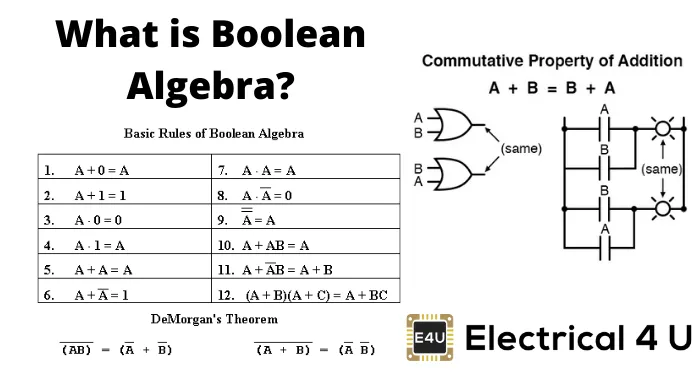

        

 

# Module 8: [Boolean Algebra](https://www.electrical4u.com/boolean-algebra-theorems-and-laws-of-boolean-algebra/)

 

 

# Class Discussion
## Answer the questions on the Markdown file located within your `Module8` directory (Module8.md).`(0pts)`

<!-- This is a comment. It is not processed by the code -->
<!-- Welcome! These are your questions. -->
<!-- Answer using full sentences to receive all points. -->
<!-- 

What part of the instructions was incomplete or unclear?

 - Answer:

Type down any class notes below this sentence:

Lackluster responses may result in point deductions.
-->

* ### Save the file, Commit your changes and push them to your remote repository by the end of the class.
* ### You may complete the answers by issuing additional commits and pushing them before the next class.

 

## [Next Module ->](/../../tree/main/Modules/Module9/Module9.md)