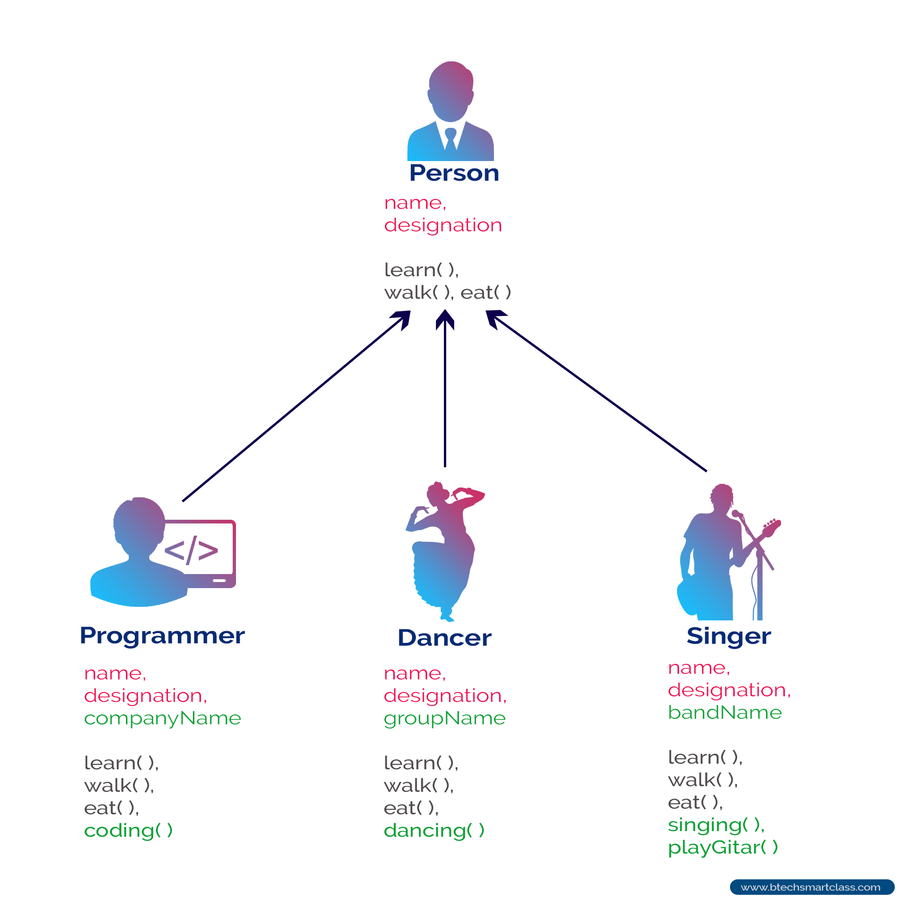

<div style="text-align:center">
        
</div>
<br>

# Module 9: Inheritance

Inheritance is a common and useful practice when you're trying to reuse code. It allows you to use the code defined in a class in a similar other one. To inherit from a class you must create a second class and use the `extends` keyword.

### `Dog.java`
```java
class Dog{
        // variables
        boolean wild = true;
        
        // constructors
        
        // methods
        public void piss(){}
        
        // internal classes
        
}
```

<br>

### `GermanShepherd.java`
```java
class GermanShepherd extends Dog{
// Includes everything defined in Dog

}
```

### Overriding
On occasions you will want to make modifications to a method that has already been defined in the super class. When attempting to do, you will notice an error. This is because the compiler does not know which version to use. For this reason we will use an `@Override` tag above the method we want to use as a replacement.

<br>

```java
class GermanShepherd extends Dog{

        @Override
        public void piss(){} 
}
```


<br>

# Class Discussion
## Answer the questions on the Markdown file located within your `Module9` directory (Module9.md).`(0pts)`


<!-- This is a comment. It is not processed by the code -->
<!-- Welcome! These are your questions. -->
<!-- Answer using full sentences to receive all points. -->
<!-- 


What part of the instructions was incomplete or unclear?

 - Answer:

Type down any class notes below this sentence:


Lackluster responses may result in point deductions.
-->

* ### Save the file, Commit your changes and push them to your remote repository by the end of the class.
* ### You may complete the answers by issuing additional commits and pushing them before the next class.

<br>

## [Next Module ->](/../../tree/main/Modules/Module10/Module10.md)
