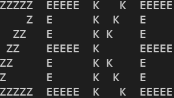
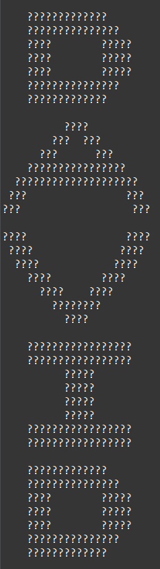
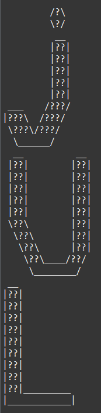
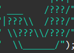

        

 

# ASCII Art Project
"ASCII art is a computer text art created with American Standard Code for Information Interchange code.  It uses ASCII characters to produce images ranging from simple and functional emoticons to elaborate works of art" (O'Riordan, 2014).

"Consist of pictures pieced together from individual characters" (Codeacademy, 2021).

Examples:

 

 
Reference: 
 
O'Riordan, K (2014). ASCII art. <em>Encyclopedia Britannica</em>. https://www.britannica.com/topic/ASCII-art
 
 

## Activity: `ASCII Art (22 points)`
* Create a package in your `MainProject` named `csi.lastname.ascii`
* Create within it a class named `Acsii.java`

The programs run a main method that displays your initials, name or your nickname in block letters or keyboard characters. It should be at least **4** characters long. 

Each character of your name should be composed of at least 35 characters (5 X 7). Spaces per characters are included. You are encouraged to use a larger custom font of your own creation. You should print each character vertically. A satisfactory output would look like:

 

 

Some creative examples may look like:

 

Take a screenshot of your terminal's output. Save it in the Project directory. Name the file using the following convention: `ASCII-Art-CSI-Jose-Quintana-1.png`

 

*Forward slashes wil enter an escape sequence. To avoid this, use two forward slashes instead of one. This will print a single character*
> \
 
eg. 

 

## 
Rubric

| Criteria | Points | 
|-----------|--------|
| Java file compiles and outputs a beautifully stylized, and readable, ASCII art version of your Name, Initials or nickname in the console. | 
`12 points`
 |
| Each character of your name is composed of at least 35 characters (5x7). Spaces per character are included.| 
`5 points`
 |
| Correctly created class within package | 
`2 points`
 |
| Take a screenshot of your terminal's output. Save it in the Project directory. Name the file using the following convention: `ASCII-Art-CSI-Jose-Quintana-1.png` | 
`3 points`
 |
|Total:|
`22 points`
 |

